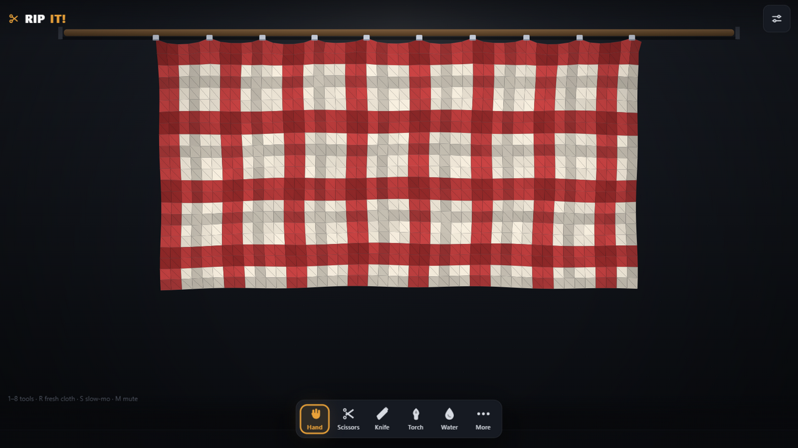
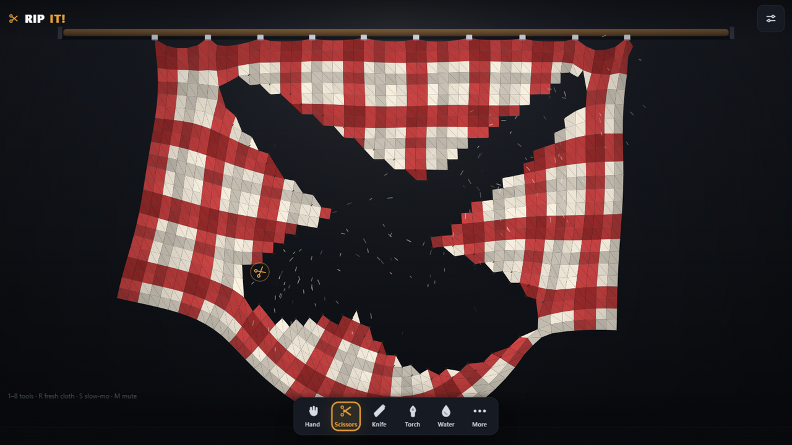
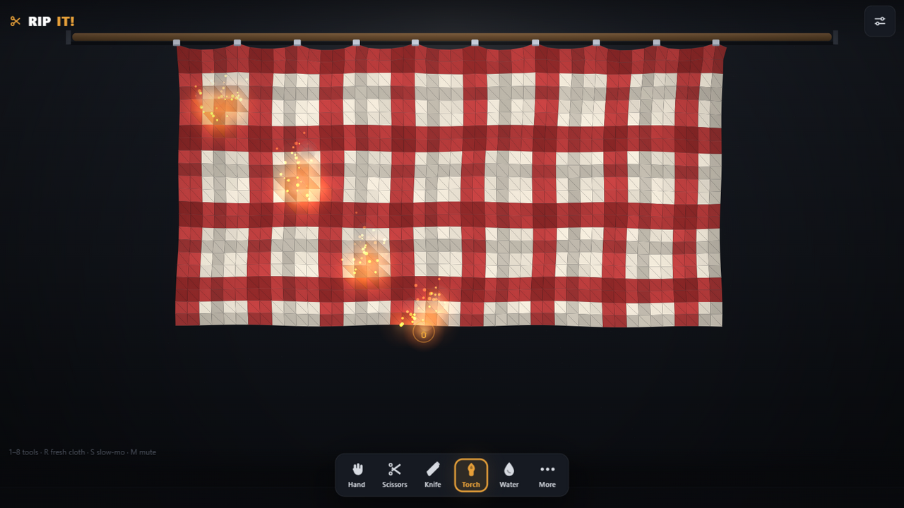
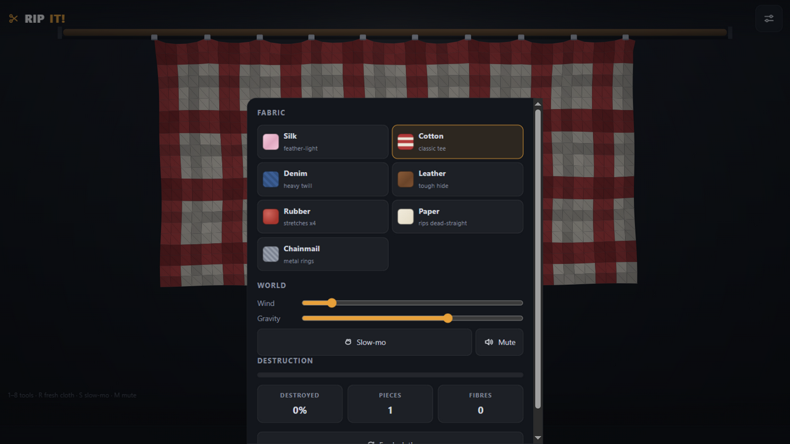
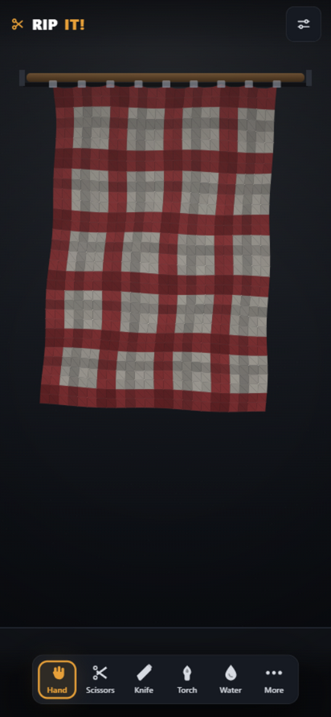

<p align="center">
  
</p>

<h1 align="center">RIP IT!</h1>

<p align="center">
  <b>A tiny physics playground about tearing cloth apart.</b><br>
  Grab it, cut it, burn it, soak it. Every fibre is simulated.
</p>

<p align="center">
  
</p>

## What is this?

RIP IT! is a relaxing destruction toy. A piece of fabric hangs from a rod, and you get to do the thing everyone secretly wants to do: rip it apart.

Every thread is a tiny spring, so tears run, spread and fray like real fabric. Silk floats, paper rips in dead-straight lines, rubber stretches and snaps back. There is nothing to win and nothing to lose. Just rip, listen, relax, and when the cloth is gone, hang a fresh one.

Shred a cloth completely and you get the confetti party with your final numbers: fibres ripped, pieces, and time.

## Seven fabrics, all different

| Fabric | Feel |
|--------|------|
| Silk | feather light, floats on the wind, tears easily |
| Cotton | the classic. tough but fair |
| Denim | heavy twill, takes real effort |
| Leather | tough hide, barely notices the wind |
| Rubber | stretches four times before it snaps |
| Paper | rips dead straight, burns in seconds |
| Chainmail | metal rings, clinks and sparks |

## Eight tools

| Tool | What it does |
|------|--------------|
| Hand | pinch the cloth and pull. yank hard and it rips |
| Scissors | tap to snip, or drag to cut a clean line |
| Knife | slash fast to cut, slow moves just nudge it |
| Torch | hold on the cloth to set it on fire |
| Water | soak it: heavier, sags, tears easier, fire proof |
| Pin | nail the cloth down anywhere, or unclip it from the rod |
| Sew | stitch torn seams back together |
| Blower | hold to blast a gust of air |

## See it in action

| | |
|---|---|
|  <br> Rips spread and fray in real time |  <br> Fire catches, spreads and chars |
|  <br> Seven fabrics, wind, gravity and stats |  <br> Built for phones first |

## The fun stuff

- A real time Verlet cloth simulation: every fibre is a spring, every tear is physical
- Tear juice: freeze frames on big rips, haptic buzzes on your phone, sparks, thumps and snips
- Sound is generated live: silk whispers, denim rumbles, chainmail clinks
- Slow motion mode for that one perfect pull
- Wind, gravity and slow-mo sliders to make the cloth do what you want
- Fully shred a cloth for the confetti payoff

## Get it

Grab the latest build from the [releases page](https://github.com/Razee4315/rip-it/releases):

- **Android**: signed arm64 APK (or the universal APK for other devices)
- **Windows**: exe installer or portable msi

## Run it yourself

```bash
npm install
npm run dev          # web version at http://localhost:1420
npm run tauri dev    # native desktop window (needs Rust + Tauri deps)
```

Other useful commands:

```bash
npm run build        # typecheck + production build
npm run test         # unit tests
npm run lint         # biome checks
```

Android builds run in CI only (GitHub Actions), so you do not need Android Studio.

## Under the hood

Tauri 2, React 18, TypeScript, Vite, styled components. The cloth engine is a hand written Verlet integration sim with tear, burn, wet, cut and sew passes. Sound effects are synthesized on the fly with the Web Audio API. No game engine, no assets to load, it is all code.

```
src/sim      cloth physics engine
src/audio    generated sound effects
src/ui       dock, sheets, canvas shell
src/theme    design tokens
src-tauri    Rust host (desktop + android)
```

## License

MIT
