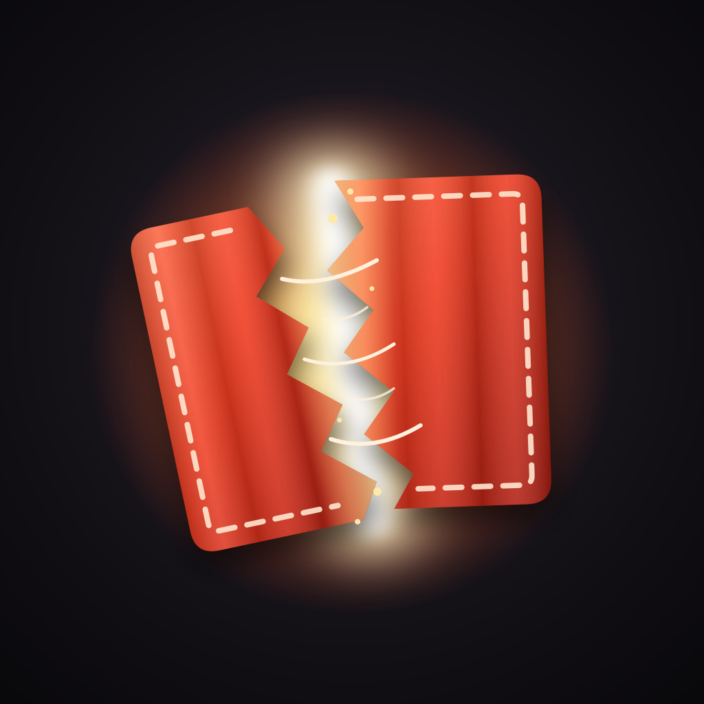

<p align="center">
  
</p>

<h1 align="center">RIP IT!</h1>

<p align="center">
  <b>A physics game about tearing cloth apart.</b><br>
  Grab it, cut it, burn it, soak it, blow it up. Then stitch it back together.
</p>

## What is this?

A square of fabric hangs in front of you, and you get to do the thing everyone secretly wants to do: rip it apart.

The cloth is a real 3D simulation. It hangs in pleats, billows in the wind and casts a shadow on the wall behind it. Pull hard enough and it tears, and the tear runs the way a tear in real fabric runs: along the threads, from the weakest point, faster the harder you pull. Denim laughs at bare hands until you snip a notch in its edge. Paper rips dead straight. Latex stretches to three times its length and then snaps.

There are 24 levels across four worlds, each with a goal and three stars to earn, and a sandbox for when you just want to wreck something.

## The worlds

| World | Place | What you learn |
|-------|-------|----------------|
| 1. Laundry Day | A sunny backyard and a washing line | Ripping by hand, scissors, cutting out shapes |
| 2. Grand Theatre | Velvet, spotlights, a stage | The blade, unveiling paintings, working against the clock |
| 3. The Forge | Brick, firelight, sparks | Fire, water, firecrackers, leather and chainmail |
| 4. Paper Dojo | Shoji screens and tatami | Precision cuts, and mending with a needle |

Goals change from level to level: tear the cloth into pieces, cut a shape free without straying from the line, burn a banner while keeping its crest intact, reveal a painting, or stitch a torn silk back together.

## Ten fabrics

| Fabric | Feel |
|--------|------|
| Cotton | The classic. Rips with a firm pull |
| Linen | Crisp bedsheet. Tears in long runs |
| Silk | Feather light, floats on a breath, shreds easily |
| Velvet | Heavy stage curtain that drinks the light |
| Denim | Too tough to rip, until you notch it |
| Burlap | Rough sackcloth. Burns like tinder |
| Leather | Shrugs off everything but a blade or a blast |
| Latex | Stretches and stretches, then snaps |
| Paper | Rips dead straight, burns in seconds, falls apart when wet |
| Chainmail | Riveted steel rings. Bring bolt cutters |

## Nine tools

| Tool | What it does |
|------|--------------|
| Hand | Grab and pull. On a phone, two fingers rip it apart |
| Scissors | Drag for a clean straight cut at any angle. Tap for a snip |
| Blade | Slash fast to slice. Slow strokes won't bite |
| Torch | Hold to light it. Fire climbs |
| Water | Soak the cloth: heavier, weaker, fireproof |
| Firecracker | Stick it on, stand back |
| Pin | Pin the cloth anywhere, or pull a pin out |
| Needle | Drag along a tear to stitch it shut |
| Blower | A blast of air |

## Get it

Grab the latest build from the [releases page](https://github.com/Razee4315/rip-it/releases):

- **Android**: signed arm64 APK (or the universal APK for other devices)
- **Windows**: exe installer or portable msi

## Run it yourself

```bash
npm install
npm run dev          # web version at http://localhost:1420
npm run tauri dev    # native desktop window (needs Rust + Tauri deps)
```

Other useful commands:

```bash
npm run build        # typecheck + production build
npm run test         # physics unit tests
npm run lint         # biome checks
```

Android builds run in CI only (GitHub Actions), so you do not need Android Studio.

The app icons in `src-tauri/icons` are generated from one vector source. CI does this on every release; to refresh them locally:

```bash
npx tauri icon design/icon.svg --output src-tauri/icons
```

## Under the hood

Tauri 2, React 18, TypeScript, Vite. No game engine and no image or sound files: every texture, backdrop and sound effect is generated in code.

- **Cloth**: an XPBD solver over a triangle mesh, 720 small steps a second. Tearing works by splitting mesh points so neighbouring triangles stop sharing them, which is why a tear opens across the direction of stress and keeps running from its tip. Scissors slide mesh points onto the blade's path, so cuts are straight at any angle instead of following the grid.
- **Rendering**: WebGL 2. Each fabric has its own procedural weave (plain, twill, satin, velvet pile, leather grain, paper fibre, ring mail) with normal mapping, sheen, translucency and a real shadow map. Fire eats the cloth with a glowing ember edge. HDR with bloom, then filmic tone mapping.
- **Sound**: synthesised live with Web Audio. A rip is built from tiny grains of noise fired per broken fibre, so it follows the tear itself.
- **Battery**: the game drops to 30 fps when nothing is happening, stops entirely in the background, and steps its own graphics quality down on devices that struggle.

```
src/engine/cloth   the simulation: solver, tearing, cutting, fire, sewing
src/engine/gfx     renderer, shaders, procedural fabrics and backdrops
src/engine/audio   synthesised sound
src/engine/Game.ts the loop, tools and objectives
src/game           levels, progress, sandbox presets
src/ui             screens and HUD
src-tauri          Rust host (desktop + android)
```

## License

MIT
